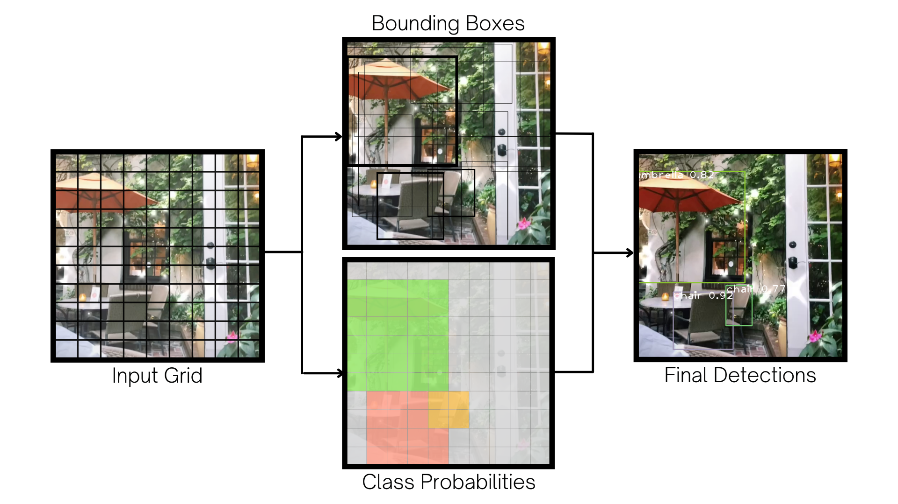

# Machine Learning-Powered Video Library

Video sharing applications today lack the functionality for users to search videos by their content. As a solution I developed a searchable video library that processes videos and returns exact matches to queries using machine learning and artificial intelligence including speech recognition, optical character recognition, and object detection. 

*[Link to Web Application](https://streamlit.io/)*

Photo here.

## Business Problem

Applications for video sharing and storage may be able to enhance user experience by allowing users to search for videos by their content, such as specific words or objects in the video. One of the most popular video sharing apps right now is TikTok where users can save the videos they like to their profile but yet cannot search through the liked videos. 

As it lacks that functionality, its millions of users are forced to scroll through every single video they have ever liked to find one single clip, and over again. To address this problem, I create a library of TikTok videos and build a search engine that breaks down the videos into several features and returns exact matches to any given query.

## Data Understanding

A sample of 140 videos are provided in the [videos](https://github.com/czarinagluna/ml-video-library/tree/main/data/videos) folder in this repository for the purpose of demonstrating the end-to-end process I performed. This set of sample is originally saved from my personal user account, but in addition, I downloaded two datasets each containing 1000 videos from Kaggle (found [here](https://www.kaggle.com/datasets/marqueurs404/tiktok-trending-videos) and [here](https://www.kaggle.com/datasets/erikvdven/tiktok-trending-december-2020?select=videos)). Altogether I analyzed over 2000 videos for the whole project, which I uploaded on [Google Drive](https://drive.google.com/drive/folders/1-OMkbBMzBGWH9PVU0ojZACtnFlP3ANbE?usp=sharing). You may download all the videos to explore the complete dataset.

**Multimedia Data**

A video is a complex data type that can be broken down in a lot of different ways. Through feature engineering, I turned the raw videos into multiple data features that I extracted using the following approaches:
- Converting the video to audio and transcribing the speech
- Breaking down the video as a sequence of images or frames
    - Recognizing on-screen text in the video frames
    - Detecting image objects in the video frames

## Video Processing

1. Audio processing using `moviepy`, `pydub`, and `speech_recognition`
2. Optical character recognition using `opencv-python`, `PIL`, and `pytesseract`
3. Object detection using `opencv-python` and `YOLOv3` algorithm

**YOLO Object Detection**

To process the videos, the state-of-the-art object detection system YOLO is used. YOLO looks at the image once. Thus, the name *You Only Look Once*.
- The input image is divided into a grid of *x* by *x* number of cells. 
- Around the cells, bounding boxes are predicted with confidence scores.
- Class probabilities are mapped, with the bounding boxes weighted by the predictions.
- The output of objects detected are displayed if the threshold set is met.

An example from a video:

***

Using the above packages and models, the features are extracted as text and I applied Natural Language Processing (NLP) to process the text and to create a corpus of all the words to search through. Finally I built the search engine using `BM25` and deployed the full app via Streamlit.

## Search Results

Demo here.

SOURCE CODE: [Main Notebook](https://github.com/czarinagluna/ml-powered-video-library/blob/main/main.ipynb)

# Contact

Feel free to contact me for any questions and connect with me on [Linkedin](https://www.linkedin.com/in/czarinagluna).
